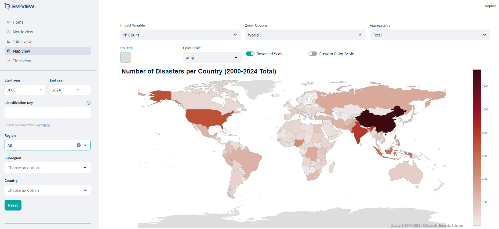

# EM-VIEW: A Community Dashboard for your EM-DAT Data




This is a [Streamlit](https://streamlit.io/) Web App designed to visualize 
the [EM-DAT International Disaster Database](https://www.emdat.be/) data 
contained in your official EM-DAT xlsx file. EM-VIEW has multiple tabs with 
specific features responding to filters:
- Metric view: impact statistics, disaggregated by disaster types;
- Table view: the EM-DAT dataframe that can be filtered by column names;
- Map view: global or regional impact maps by country;
- Time view: yearly-aggregated timeseries of impact, with multiple stacking 
options.

You can download the EM-DAT data by registering on the 
[EM-DAT Data Portal](https://public.emdat.be/).

## Use the app on Streamlit Community Cloud

Visit https://emview.streamlit.app/

## Install, Use, and Customize the App Locally 

The app relies on streamlit version 1.37.

### Install Dependencies:
   ```bash
   pip install -r requirements.txt
   ```

Check `requirements.txt` for details.

### Run App

With streamlit installed, use the following command to run the app:
   ```bash
    streamlit run app.py
   ```

## Licence

MIT, see attached `License` file. This license applies to the content of this 
repository and does not cover the EM-DAT data usage rights. See 
[EM-DAT Terms of Use](https://doc.emdat.be/docs/legal/).

## Acknowledgement

The initial version of EM-VIEW was developed under the EM-DAT project with 
the support of USAID. 